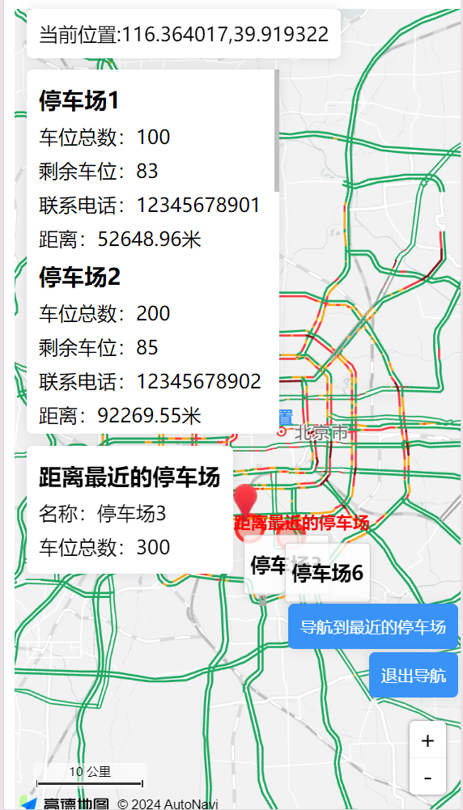

### 基于高德地图API开发的地图导航页面

#### 页面效果

#### 功能介绍

**地图显示与缩放**
通过调用高德地图API，创建一个可缩放的地图实例，并设置地图的中心点和缩放级别。同时，添加工具栏和比例尺，以便用户更好地操作地图。

**位置标记与导航**
利用高德地图API的定位服务，获取当前位置的经纬度信息，并在地图上标记。为标记添加点击事件，用户点击标记后，可以查看当前位置的详细信息。同时，为按钮添加点击事件，用户点击后，应用将调用导航服务，为用户规划到达最近停车场的路径。

**停车场信息展示**
将停车场的位置、车位总数、剩余车位等信息存储在数组中。为每个停车场创建一个标记，并在地图上显示。同时，为每个标记添加点击事件，用户点击后，可以查看停车场的详细信息（这里停车场数据是自己创建的）。

**实时位置更新**
通过调用高德地图API的定位服务，每隔一段时间获取当前位置的经纬度信息，并在地图上更新标记。同时，在地图上显示当前位置的详细信息（这里使用的是自己创建的数据，并在一定范围内随机刷新位置）。

**导航路径规划**
调用高德地图API的导航服务，根据当前位置和目的地，为用户规划最短路径。将导航结果在地图上显示。
